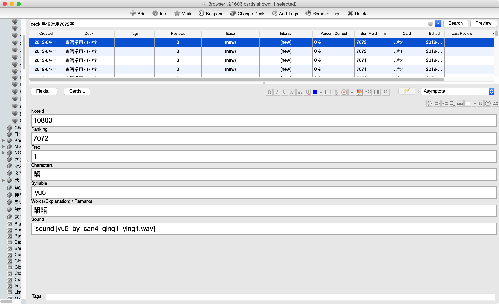

See [粵語審音配詞字庫](https://humanum.arts.cuhk.edu.hk/Lexis/lexi-can/)

根据 [粵語審音配詞字庫常用字頻序表](https://humanum.arts.cuhk.edu.hk/Lexis/lexi-can/)，抓取高频字的读音、词语、粤拼等信息，并制成 Anki 卡包。

## 下载

* [apkg](https://github.com/hmgqzx/Practical_Pet_Projects/tree/master/Scraper/%E7%B2%B5%E8%AA%9E%E5%AF%A9%E9%9F%B3%E9%85%8D%E8%A9%9E%E5%AD%97%E5%BA%AB/apkg)：已包含音频文件，不需另外下载导入
* [爬取得到的数据 - csv 格式](https://github.com/hmgqzx/Practical_Pet_Projects/tree/master/Scraper/%E7%B2%B5%E8%AA%9E%E5%AF%A9%E9%9F%B3%E9%85%8D%E8%A9%9E%E5%AD%97%E5%BA%AB/data)
* [独立音频文件](https://github.com/hmgqzx/Practical_Pet_Projects/tree/master/Scraper/%E7%B2%B5%E8%AA%9E%E5%AF%A9%E9%9F%B3%E9%85%8D%E8%A9%9E%E5%AD%97%E5%BA%AB/media)

## apkg 卡片内容

每张卡片含有以下内容：

* `Id`: 解决 Anki 首字段不得重复的问题

* `Ranking`: 字的频序，排名越前说明越常用。如`的`字，此值为`1`

* `Freq.`: 字的频次，越大说明越常用

* `Characters`: 字

* `Syllable`: 音节（粤拼）

* `Words(Explanation) / Remarks`: 词汇等

  * ~~像 `香水, 香味, 香火[2..]香油, 香料` 中的 `[2..]` 是原网页中的内容，指示后面隐藏的词语还有 2 个；不是乱码~~ 已清洗

* `Sound`: 读音文件；陳京英老师录音，故在尾部加上`_by_can4_ging1_ying1`

  > 本校雅禮中國語文研習所前導師`陳京英`老師義務參與本網頁之錄音工作，特此致謝。

### 截图

## Todo

